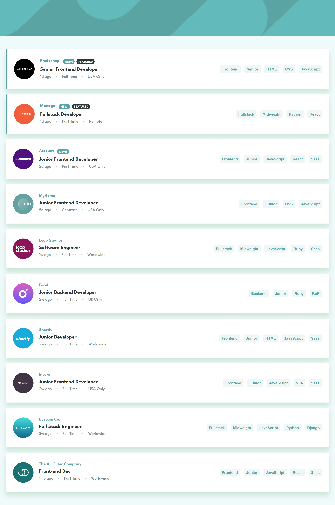

# Static Job Listings

## Índice

- [Resumo](#resumo)
  - [Screenshot](#screenshot)
  - [Links](#links)
- [Processo](#processo)
  - [Construção](#construção)
  - [Aprendizado](#aprendizado)
  - [Recursos](#recursos)
- [Autor](#autor)

<br/>

# Resumo

Este projeto consiste em uma lista de vagas de emprego estáticas, onde o usuário pode visualizar informações sobre cada vaga, como a empresa contratante, a localização, o tipo de emprego e as habilidades necessárias. É possível aplicar filtros por habilidades, facilitando a busca por vagas que se encaixem no perfil do usuário. Com uma interface amigável e fácil de usar, o projeto oferece uma experiência de usuário agradável e intuitiva.

<br/>

## Screenshot

<p style="text-align:center;">
    
</p>

<br/>

## Links

- [Lista de Vagas de Emprego Estáticas](https://13-static-job-listings.vercel.app)

<br/>

# Processo

<br/>

## Construção

Durante a construção deste código, foram utilizados diversos conceitos e técnicas de programação em JavaScript, como funções assíncronas, manipulação da DOM e trabalho com eventos. Além disso, foram aplicados conceitos de modularização, com a separação do código em módulos distintos.

Para a construção da interface do aplicativo, foram utilizadas técnicas de desenvolvimento front-end, como a criação dinâmica de elementos HTML e a estilização dos elementos com SCSS.

O código faz uso de dois módulos distintos, sendo um responsável pela criação dos elementos HTML com as informações das vagas de emprego e outro responsável por filtrar as vagas de acordo com critérios selecionados pelo usuário.

Foi utilizado o conceito de Promises em conjunto com a sintaxe `async/await` para garantir que as informações das vagas seriam obtidas de forma assíncrona e eficiente.

O código também faz uso de diversos métodos e propriedades do objeto `Document`, como `getElementById` e `createEvent`, para manipular a DOM e criar eventos personalizados.

Em resumo, o código utiliza diversas técnicas e conceitos de programação em JavaScript e desenvolvimento front-end para criar uma interface de usuário dinâmica e interativa para a exibição de vagas de emprego e sua filtragem.

<br/>

# Aprendizado

Este projeto permitiu aprimorar habilidades em manipulação da DOM com JavaScript, bem como em estilização de páginas com CSS. Também foi possível aprender mais sobre a metodologia BEM e a linguagem de pré-processador CSS Sass. No trecho de código apresentado abaixo, é possível observar como foi realizada a filtragem de vagas por habilidades. O método filter() é aplicado em uma array de objetos que representa as vagas de emprego, e a função fornecida como argumento verifica se a habilidade desejada é encontrada em uma string que contém todas as habilidades requeridas pela vaga.

javascript

```javascript
function filterJobsBySkill(skill) {
  return jobs.filter(job => job.requirements.toLowerCase().includes(skill.toLowerCase()));
}
```

<br/>

# Recursos

- [async function](https://developer.mozilla.org/pt-BR/docs/Web/JavaScript/Reference/Statements/async_function)

- [await]( https://developer.mozilla.org/pt-BR/docs/Web/JavaScript/Reference/Operators/await)

- [import]( https://developer.mozilla.org/pt-BR/docs/Web/JavaScript/Reference/Statements/import)

- [export default](https://developer.mozilla.org/pt-BR/docs/Web/JavaScript/Reference/Statements/export)

- [document.querySelectorAll()](https://developer.mozilla.org/pt-BR/docs/Web/API/Document/querySelectorAll)

- [NodeList.forEach()](https://developer.mozilla.org/pt-BR/docs/Web/API/NodeList/forEach)

- [HTMLElement.querySelectorAll()](https://developer.mozilla.org/pt-BR/docs/Web/API/Element/querySelectorAll)

- [HTMLElement.setAttribute()](https://developer.mozilla.org/pt-BR/docs/Web/API/Element/setAttribute)

- [document.createElement()](https://developer.mozilla.org/pt-BR/docs/Web/API/Document/createElement)

- [HTMLElement.appendChild()](https://developer.mozilla.org/pt-BR/docs/Web/API/Node/appendChild)

- [HTMLElement.classList](https://developer.mozilla.org/pt-BR/docs/Web/API/Element/classList)

- [HTMLElement.src](https://developer.mozilla.org/pt-BR/docs/Web/API/HTMLImageElement/src)

- [HTMLElement.alt](https://developer.mozilla.org/pt-BR/docs/Web/HTML/Global_attributes/alt)

- [HTMLElement.textContent](https://developer.mozilla.org/pt-BR/docs/Web/API/Node/textContent)

- [createElement()](https://developer.mozilla.org/pt-BR/docs/Web/API/Document/createElement)

- [classList.add()](https://developer.mozilla.org/pt-BR/docs/Web/API/Element/classList)

- [dispatchEvent()](https://developer.mozilla.org/pt-BR/docs/Web/API/EventTarget/dispatchEvent)

- [new Event()](https://developer.mozilla.org/pt-BR/docs/Web/API/Event/Event_constructor)

<br/>

# Créditos

O projeto é parte do desafio de Frontend

<br/>

# Autor

<div align="center">

<a href="https://www.linkedin.com/in/mathewsmattar/" target="_blank">
  
</a>
<a href="mailto:mathmattar@hotmail.com" target="_blank">
  
</a>

</div>
